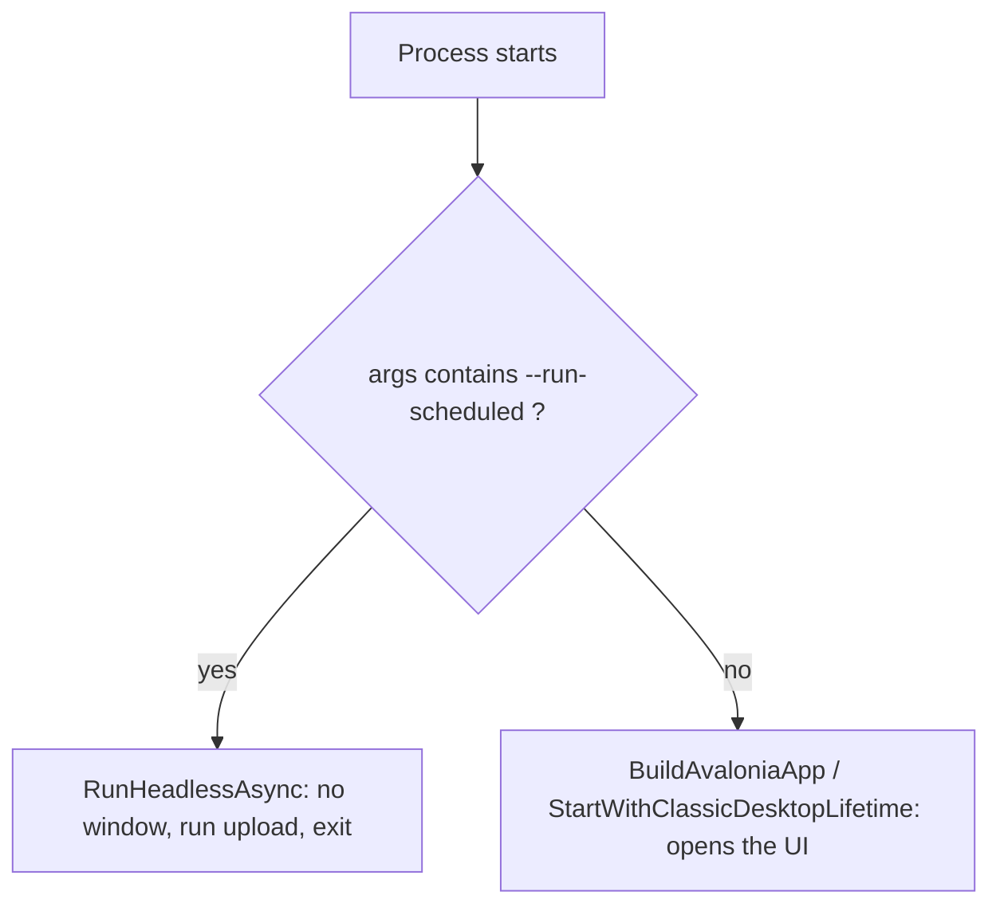
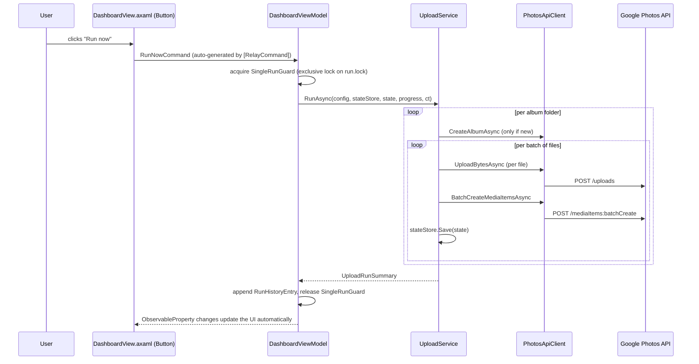

# Architecture Guide

This document explains how the codebase is organized and how the pieces fit
together, so that a .NET developer who has **never used Avalonia** can
understand the project, extend it with new features, and diagnose/fix bugs.

It assumes you already know: C#, `Task`/`async`-`await`, dependency-free MVVM
concepts (Model / ViewModel / View), and basic JSON serialization. It does
**not** assume any prior Avalonia knowledge — anything Avalonia-specific is
explained inline.

---

## 1. What this application does (functional summary)

A desktop app (Windows + macOS) that:

1. Takes a **root folder** chosen by the user. Each direct subfolder becomes
   an **album** in Google Photos (same name).
2. Uploads every photo/video inside those subfolders to that album, skipping
   files already uploaded (tracked in a local `state.json`).
3. Can run **on demand** (button in the UI) or **on a schedule**, using the
   native OS scheduler (Windows Task Scheduler / macOS `launchd`), by
   launching itself in a special headless (no window) mode.
4. Persists everything (config, progress, run history, OAuth token) as JSON
   files under a per-user app-data folder — never in the project/executable
   folder.

There is no backend/server: it's a 100% local desktop app that talks
directly to the public Google Photos Library API over HTTPS.

---

## 2. Avalonia in one page (what you need to know, nothing more)

Avalonia is a cross-platform XAML-based UI framework, deliberately modeled
after WPF. If you know WPF/UWP/MAUI XAML this is almost 1:1. If you don't,
here's the minimum:

- **XAML files (`.axaml`)** describe the UI declaratively (controls, layout,
  data bindings). Each `.axaml` file has a **code-behind** `.axaml.cs` file
  with the same class name, generated/linked via `InitializeComponent()`.
  Code-behind in this project is intentionally almost empty — just
  `InitializeComponent()` plus, in one case, a native file-picker call that
  has no ViewModel-friendly equivalent (see §6.3).
- **MVVM pattern**: Views (`.axaml`) bind to ViewModels (plain C# classes)
  via the `DataContext` property and `{Binding PropertyName}` expressions in
  XAML. The ViewModel never references the View — communication is
  one-directional via data-binding and `ICommand`.
- This project uses **CommunityToolkit.Mvvm** (`CommunityToolkit.Mvvm` NuGet
  package) to reduce MVVM boilerplate:
  - `[ObservableProperty] private string _foo;` auto-generates a public
    `Foo` property that raises `INotifyPropertyChanged` when set (so the UI
    updates automatically). Reference it in code as `Foo`, not `_foo`.
  - `[RelayCommand] private void Save() { ... }` auto-generates a public
    `SaveCommand` (`ICommand`) that XAML buttons bind to via
    `Command="{Binding SaveCommand}"`. Works with `async Task` methods too
    (generates an async command).
  - `[RelayCommand(CanExecute = nameof(CanRunNow))]` ties the command's
    enabled/disabled state to a boolean method — see
    [DashboardViewModel.cs](UI/ViewModels/DashboardViewModel.cs).
  - These are all **source generators**: the generated code isn't in the
    repo, it's produced at compile time. If you add a new
    `[ObservableProperty]`/`[RelayCommand]` and don't see the generated
    member, just rebuild (`dotnet build`).
- **`AvaloniaUseCompiledBindingsByDefault=true`** (set in the `.csproj`)
  means bindings are compiled and type-checked at build time using
  `x:DataType="vm:SomeViewModel"` declared at the top of each `.axaml` file.
  If you rename/remove a ViewModel property that's bound in XAML, you'll get
  a **build error**, not a silent runtime failure — this is the main safety
  net when refactoring.
- **`ObservableCollection<T>`** (from `System.Collections.ObjectModel`, plain
  BCL, nothing Avalonia-specific) is used for any list shown in the UI
  (album progress, log lines, run history) — adding/removing items
  automatically updates the bound list control.

If you only remember one thing: **treat `.axaml` like WPF XAML, and
`[ObservableProperty]`/`[RelayCommand]` like a code-gen shortcut for manual
`INotifyPropertyChanged` properties / `ICommand` implementations.**

---

## 3. Entry point and startup flow

### 3.1 `Program.cs` — the real `Main`

This project uses [top-level statements](Program.cs), so `Program.cs` itself
*is* `Main`. It branches into two completely different modes:



- **No arguments** (double-click, `dotnet run`, launched from Finder/Explorer):
  builds and starts the Avalonia app (`App` class, see §3.2), which shows
  `MainWindow`.
- **`--run-scheduled`**: this is how the OS scheduler invokes the app in the
  background. It calls `RunHeadlessAsync()`, which:
  1. Takes the single-run guard (a file lock, see §7.3) so a scheduled
     run never overlaps a manual run (or another scheduled run).
  2. Loads config/state from disk (same `ConfigStore`/`StateStore` the UI
     uses).
  3. Runs the actual upload logic via `UploadService.RunAsync(...)` — the
     **exact same class** the UI's "Run now" button calls (see §6.1). This
     is the key design point: there is only one upload implementation,
     shared between interactive and headless modes.
  4. Writes a timestamped log file to `<AppData>/logs/run-yyyyMMdd-HHmmss.log`
     and appends a `RunHistoryEntry` (origin = `Scheduled`) to
     `run_history.json`.
  5. Returns exit code `0` (success) or `1` (failure) to the OS.

If you need to add a new CLI mode (e.g. `--reset-state`), add another
`if (args.Contains(...))` branch at the top of `Program.cs`, before the
Avalonia UI branch.

### 3.2 `App.axaml` / `App.axaml.cs` — Avalonia application object

`App` is the Avalonia equivalent of WPF's `App.xaml`/`App.xaml.cs`. Two
methods matter:

- `Initialize()` — loads `App.axaml` (just registers the `FluentTheme` and
  the `DataGrid` theme, see §2). Don't touch unless changing global styles.
- `OnFrameworkInitializationCompleted()` — this is effectively the UI
  "composition root": it creates `ConfigStore`, loads `AppConfig`, creates
  `StateStore`/`RunHistoryStore`, builds `MainWindowViewModel` (injecting
  those dependencies manually — **there is no DI container** in this
  project, everything is `new`'d up explicitly here), and assigns it as
  `MainWindow.DataContext`.

**If you add a new top-level dependency** (e.g. a new store or service used
by a ViewModel), wire it up here, in the same place, following the existing
pattern (manual constructor injection, no container).

---

## 4. Folder-by-folder map

```
Program.cs                 Entry point (UI vs. headless scheduled mode)
App.axaml / App.axaml.cs   Avalonia application bootstrap / composition root

Config/                    Application settings (AppConfig) + JSON persistence
Google/                    Everything that talks to Google (OAuth + Photos API + upload logic)
State/                     Local progress/history persistence (JSON files)
Scheduling/                OS-native background scheduling (Task Scheduler / launchd)

UI/
  ViewModels/               One ViewModel per tab (+ small support classes), MVVM, no Avalonia types
  Views/                    One View (.axaml + .axaml.cs) per tab, plus MainWindow
```

Dependency direction (high level): `UI` → `Google` / `State` / `Config` /
`Scheduling`. Nothing under `Google`, `State`, `Config`, or `Scheduling`
references `UI` or Avalonia — those namespaces are plain, UI-framework-free
C#. That's intentional: it means the whole upload/scheduling/config engine
is unit-testable and reusable without spinning up any UI, and it's exactly
why the headless `--run-scheduled` mode can reuse everything with zero
duplication.

### 4.1 `Config/`

| File | Responsibility |
|---|---|
| [`AppConfig.cs`](Config/AppConfig.cs) | Plain data class with every user-configurable setting: root folder, state/history file paths, token store path, errored-files folder, API batch size, allowed file extensions, and the list of `ScheduleEntry` for background runs. Also exposes the static `AppConfig.AppDataFolder` (per-OS app-data root, via `Environment.SpecialFolder.ApplicationData`). |
| [`ConfigStore.cs`](Config/ConfigStore.cs) | Loads/saves `AppConfig` as `config.json` inside `AppDataFolder`. Uses the "write to `.tmp` then `File.Move(overwrite:true)`" pattern for atomic writes (avoids a corrupted config file if the app is killed mid-write). |

### 4.2 `Google/`

| File | Responsibility |
|---|---|
| [`AuthHelper.cs`](Google/AuthHelper.cs) | Wraps `Google.Apis.Auth` OAuth2 flow. Reads the OAuth client secrets from `client_secret.json`, embedded in the assembly as a resource (so the user never has to supply it). Opens the browser on first sign-in, then silently reuses/refreshes the token stored in `TokenStorePath` (`FileDataStore`). Requests only the `photoslibrary.appendonly` scope (create albums + add photos — cannot read or modify the rest of the library). |
| [`PhotosApiClient.cs`](Google/PhotosApiClient.cs) | Thin, hand-rolled HTTP client for the **Google Photos Library API** (there is no official modern typed .NET client for this API, hence raw `HttpClient` + manual JSON (de)serialization with `System.Text.Json`). Three operations: `CreateAlbumAsync`, `UploadBytesAsync` (uploads raw bytes, returns an "upload token"), `BatchCreateMediaItemsAsync` (redeems up to `BatchSize` upload tokens at once and attaches them to an album, returning per-file success/failure). Detects HTTP 429 and throws `QuotaExceededException`. |
| [`MimeTypeHelper.cs`](Google/MimeTypeHelper.cs) | Static extension-to-MIME-type lookup table used when uploading bytes. **Add new supported file types here AND in `AppConfig.AllowedExtensions`** (see §8.1). |
| [`QuotaExceededException.cs`](Google/QuotaExceededException.cs) | Marker exception thrown when Google returns HTTP 429 (daily quota exhausted). Caught by `UploadService` to stop gracefully and preserve progress. |
| [`UploadService.cs`](Google/UploadService.cs) | **The core business logic.** `UploadService.RunAsync(...)` is the single entry point used by both the UI ("Run now") and the headless scheduled mode (see §5). `ReprocessErroredAsync(...)` backs the UI's "Reprocess errors" button: same upload logic but rooted at the errored folder (see §5.1). |

### 4.3 `State/`

| File | Responsibility |
|---|---|
| [`AppState.cs`](State/AppState.cs) | Plain data class persisted as `state.json`: album-name → album-id map, uploaded-file-path → media-item-id map, per-file failure counters, permanently-skipped files, and the daily API request counter (`UsageDate`/`UsageCount`). This is what makes runs resumable. |
| [`StateStore.cs`](State/StateStore.cs) | Loads/saves `AppState` as `state.json`, same atomic-write pattern as `ConfigStore`. |
| [`RunHistoryEntry.cs`](State/RunHistoryEntry.cs) | Plain data class for one row in the History tab: start/end time, `RunOrigin` (`Manual`/`Scheduled`), `RunStatus` (`Ok`/`QuotaExceeded`/`Error`/`Cancelled`), counts, error message. |
| [`RunHistoryStore.cs`](State/RunHistoryStore.cs) | Loads/appends to `run_history.json` (keeps only the most recent 100 entries), same atomic-write pattern. |

### 4.4 `Scheduling/`

| File | Responsibility |
|---|---|
| [`ScheduleEntry.cs`](Scheduling/ScheduleEntry.cs) | Plain data class: one weekly recurring trigger (`DayOfWeek` + `Hour` + `Minute`). |
| [`ScheduleCalculator.cs`](Scheduling/ScheduleCalculator.cs) | Pure function, OS-independent: given a list of `ScheduleEntry`, computes the next local `DateTime` occurrence. Used purely for **displaying** "next run" to the user — the actual triggering is done by the OS scheduler, not by this app polling a timer. |
| [`IBackgroundScheduler.cs`](Scheduling/IBackgroundScheduler.cs) | Interface: `RegisterAsync`, `UnregisterAsync`, `IsRegisteredAsync`. Has a static factory method `IBackgroundScheduler.Create()` that returns the right implementation for the current OS (`OperatingSystem.IsWindows()` / `IsMacOS()`). This is the extension point if you ever add Linux support (see §8.3). |
| [`WindowsTaskSchedulerRegistrar.cs`](Scheduling/WindowsTaskSchedulerRegistrar.cs) | Windows implementation, using the `TaskScheduler` NuGet package (namespace `Microsoft.Win32.TaskScheduler`). Registers one `WeeklyTrigger` per `ScheduleEntry` pointing at `<exe> --run-scheduled`, logon type `InteractiveToken` (no stored credentials needed). `[SupportedOSPlatform("windows")]`. |
| [`MacLaunchdRegistrar.cs`](Scheduling/MacLaunchdRegistrar.cs) | macOS implementation. Writes a `launchd` user agent `.plist` to `~/Library/LaunchAgents/com.jorgediegocrespo.dicresphotosuploader.plist` with one `StartCalendarInterval` dict per `ScheduleEntry`, then loads it via `launchctl bootstrap`/`bootout` (shelling out via `Process.Start`). `[SupportedOSPlatform("macos")]`. |

⚠️ Both registrars are only ever instantiated behind an `OperatingSystem.IsWindows()`/`IsMacOS()` check (see `IBackgroundScheduler.Create()` and `ScheduleViewModel`), so the wrong one is never loaded on the wrong OS.

### 4.5 `UI/ViewModels/`

Each tab in `MainWindow` has one ViewModel, all constructed once in
`MainWindowViewModel` (which is `MainWindow`'s `DataContext`, see §3.2) and
exposed as a property (`Dashboard`, `Config`, `Schedule`, `History`) that
each tab's View binds its own `DataContext` to (see `MainWindow.axaml` in
§6.1).

| File | Responsibility |
|---|---|
| [`MainWindowViewModel.cs`](UI/ViewModels/MainWindowViewModel.cs) | Root ViewModel. Just instantiates and exposes the 4 tab ViewModels. No logic of its own. |
| [`DashboardViewModel.cs`](UI/ViewModels/DashboardViewModel.cs) | Backs the Dashboard tab: per-album upload progress (`Albums`), live log lines (`LogLines`), the `RunNowCommand` that calls `UploadService.RunAsync` (same as headless mode), and the `ReprocessErrorsCommand` that calls `UploadService.ReprocessErroredAsync` — both guarded by the same `SingleRunGuard` file lock so they never overlap with each other or a scheduled run. |
| [`ConfigViewModel.cs`](UI/ViewModels/ConfigViewModel.cs) | Backs the Configuration tab: editable copies of the relevant `AppConfig` fields, `SaveCommand` (persists via `ConfigStore`), and `ReauthorizeAsync` (deletes the token store and re-runs the OAuth flow). |
| [`ScheduleViewModel.cs`](UI/ViewModels/ScheduleViewModel.cs) | Backs the Schedule tab: day-of-week checkboxes (`Days`, a list of `DayOption`), time picker (`ScheduledTime`), the enable/disable switch, and `SaveAsync` which persists `ScheduleEntries` to config **and** calls `IBackgroundScheduler.RegisterAsync`/`UnregisterAsync`. |
| [`HistoryViewModel.cs`](UI/ViewModels/HistoryViewModel.cs) | Backs the History tab: just loads and exposes `RunHistoryEntry` items from `RunHistoryStore`, newest first. |
| [`AlbumProgress.cs`](UI/ViewModels/AlbumProgress.cs) | Small immutable DTO (name + uploaded/total counts) used to populate the Dashboard's album list/grid. Not itself observable — the whole `Albums` collection is replaced/rebuilt instead of mutating individual items. |
| [`DayOption.cs`](UI/ViewModels/DayOption.cs) | Small observable DTO wrapping a `DayOfWeek` + display label + `IsSelected` checkbox state, used by the Schedule tab's day list. |

### 4.6 `UI/Views/`

Each View is a `.axaml` (markup) + `.axaml.cs` (code-behind) pair. Code-behind
is intentionally minimal everywhere:

| File | Notes |
|---|---|
| [`MainWindow.axaml`](UI/Views/MainWindow.axaml) / `.axaml.cs` | The single top-level `Window`. Just a `TabControl` with 4 `TabItem`s, each hosting one of the other Views and binding its `DataContext` to the corresponding property on `MainWindowViewModel` (`{Binding Dashboard}`, etc.). |
| `DashboardView.axaml` / `.axaml.cs` | "Run now" and "Reprocess errors" buttons, progress list/grid per album (`DataGrid`, from the separate `Avalonia.Controls.DataGrid` package), live scrolling log. |
| `ConfigView.axaml` / `.axaml.cs` | Form fields bound to `ConfigViewModel`. The code-behind has the **one non-trivial piece of code-behind in the project**: `OnBrowseRootFolder`, which opens Avalonia's native folder picker (`TopLevel.GetTopLevel(this).StorageProvider.OpenFolderPickerAsync(...)`) — this has to be code-behind because it needs a reference to the actual `Window`/`TopLevel`, which a ViewModel must never depend on. |
| `ScheduleView.axaml` / `.axaml.cs` | Day checkboxes, time picker, enable switch, save button, status text — all bound to `ScheduleViewModel`. |
| `HistoryView.axaml` / `.axaml.cs` | Read-only `DataGrid`/list bound to `HistoryViewModel.Entries`. |

---

## 5. The upload algorithm (`UploadService.RunAsync`)

This is the heart of the app. Given `AppConfig`, the loaded `AppState`, and
an `IProgress<string>` for logging:

1. Validate the root folder exists; bail out early with an error summary if not.
2. Reset the daily API-request counter if the stored `UsageDate` isn't today.
3. Sign in (`AuthHelper.GetCredentialAsync`) — silent if a valid/refreshable
   token already exists in `TokenStorePath`.
4. For each **immediate subfolder** of the root folder (sorted alphabetically):
   a. Treat the folder name as the album name. If `state.Albums` doesn't
      already have an id for it, create the album via the API and persist
      the new id immediately (`stateStore.Save(state)`), so a crash right
      after creating the album never causes a duplicate album on the next run.
   b. List files with an allowed extension (`AppConfig.AllowedExtensions`)
      that are **not** already in `state.UploadedFiles` and **not** already
      in `state.SkippedFiles` (permanently failed).
   c. Process them in chunks of `AppConfig.BatchSize` (Google's
      `mediaItems:batchCreate` limit is 50):
      - Upload each file's raw bytes (`UploadBytesAsync`) to get an "upload
        token". Per-file failures here are recorded (see step 4d) but don't
        abort the whole batch — one bad file doesn't block the rest.
      - Once a batch of tokens is collected, call
        `BatchCreateMediaItemsAsync` once to actually attach them all to the
        album, and inspect the **per-item** result (Google can accept some
        items in a batch and reject others).
      - Save state after every batch (not just every album) so progress
        survives an interruption mid-album.
   d. **Failure handling**: `RegisterFailure` reacts to the **first**
      failure for a file — there are no retries. The file is added to
      `state.SkippedFiles` (never retried again), a **copy** (never a move —
      the original is never touched) is placed under
      `<ErroredFolderPath>/<AlbumName>/<file>` for manual review, and the
      failure is recorded for the end-of-run summary (see step 6).
5. If Google returns HTTP 429 at any point, `PhotosApiClient` throws
   `QuotaExceededException`; `RunAsync` catches it specifically, saves
   state, and returns a summary with `QuotaExceeded = true` **without**
   treating it as a hard error — the intent is "come back later/tomorrow".
6. Any other unexpected exception is caught, logged, and turned into a
   failed `UploadRunSummary` — the method itself never throws. Before
   returning (on every exit path, including the happy path), if any file
   failed during the run, a summary block listing each failed file (album,
   file name, and reason) is written to the log via `ReportFailuresSummary`.

Return value: `UploadRunSummary` (a `record`) with counts and status flags
that both `DashboardViewModel` (UI) and `Program.RunHeadlessAsync`
(scheduled) use to build the `RunHistoryEntry` they append to history.

### 5.1 Reprocessing errored files (`UploadService.ReprocessErroredAsync`)

Backs the Dashboard's "Reprocess errors" button. Same shape as `RunAsync`,
but with the errored folder itself (`AppConfig.ErroredFolderPath`) as the
scanning root instead of `RootFolder` — its subfolders are album names,
matching the layout `RegisterFailure` creates. For every file found there:

- **Success**: the errored copy is deleted (`File.Delete`), and the
  *original* path (`RootFolder/<Album>/<file>`, reconstructed since the
  errored layout mirrors it) is marked in `state.UploadedFiles` and removed
  from `state.SkippedFiles`, so the Dashboard's per-album progress and any
  future `RunAsync` both see it as done.
- **Failure**: the file is simply left where it is — `RegisterReprocessFailure`
  never copies it again (unlike `RegisterFailure`, which would otherwise try
  to copy the file onto itself, since root == errored folder here).

At the end (and on every early-return path: quota exceeded, cancelled,
unexpected error) it logs two summary blocks via `ReportSucceededSummary`
and `ReportFailuresSummary`: which files were re-uploaded successfully and
which are still failing.

---

## 6. Data flow: how a click becomes an HTTP request



---

## 7. Cross-cutting concerns worth knowing before you touch anything

### 7.1 Where files live at runtime

`AppConfig.AppDataFolder` = `Environment.SpecialFolder.ApplicationData` +
`/DicresPhotosUploader` → `~/Library/Application Support/DicresPhotosUploader`
on macOS, `%APPDATA%\DicresPhotosUploader` on Windows. **Never** assume
config/state live next to the executable — they don't, by design (so
multiple builds/reinstalls share state, and the repo never accidentally
contains a real user's data).

### 7.2 Atomic JSON writes

`ConfigStore`, `StateStore`, and `RunHistoryStore` all write to a temp file
(`<path>.tmp`) then `File.Move(tmp, path, overwrite: true)`. This is
intentional and load-bearing: `File.Move` with overwrite is atomic on all
three target filesystems, so a crash mid-write can never leave a
half-written, corrupt JSON file behind. **Follow this same pattern if you
add a new persisted file.**

### 7.3 The single-run guard

Both `DashboardViewModel.RunNowAsync`/`ReprocessErrorsAsync` and
`Program.RunHeadlessAsync` call `SingleRunGuard.TryAcquire()`
(`Config/SingleRunGuard.cs`) before doing any work, and dispose the
returned lock (`using`) when done. This prevents a manual run, a
"Reprocess errors" run, and a scheduled run from racing on the same
`state.json`. If you add a **third/fourth** way to trigger an upload, it
must acquire this same guard the same way.

`SingleRunGuard` opens `AppDataFolder/run.lock` with `FileShare.None`: if
another process already holds it, the `FileStream` constructor throws
`IOException`, which is caught and turned into a `null` return ("already
running"). Two synchronization primitives were tried and rejected before
this:
- A named `Mutex`: release is thread-affine, and after the network
  `await`s inside `UploadService` the continuation resumes on an arbitrary
  thread pool thread (there is no `SynchronizationContext` in a console
  entry point), so `ReleaseMutex()` in the `finally` block threw
  `System.ApplicationException: Object synchronization method was called
  from an unsynchronized block of code`, unhandled, aborting the process.
- A named `Semaphore`: not thread-affine, but the *named* (cross-process)
  form of `Semaphore` throws `PlatformNotSupportedException` on macOS/Linux
  — .NET only implements named semaphores on Windows.

A `FileStream` lock has neither limitation: no thread affinity (safe to
acquire on one thread and dispose from another) and it works identically
on every platform .NET supports.

### 7.4 Platform-guarded code

`WindowsTaskSchedulerRegistrar` and `MacLaunchdRegistrar` are marked
`[SupportedOSPlatform(...)]` and are only ever constructed from
`IBackgroundScheduler.Create()`, which checks `OperatingSystem.IsWindows()`/
`IsMacOS()` first. The `TaskScheduler` NuGet package is only ever touched on
Windows even though it's referenced in the `.csproj` for both platforms.

### 7.5 OAuth scope

Only `photoslibrary.appendonly` is requested — this app can create albums
and add photos, but cannot read, list, or delete anything already in the
user's library. Keep this in mind if you're asked to add a "read existing
albums" feature: it will require adding a broader scope and will force
every existing user to re-consent.

---

## 8. Common tasks / "how do I..."

### 8.1 Add support for a new file extension

Two places, both required:
1. Add the extension to `AppConfig.AllowedExtensions` (default array in
   [`Config/AppConfig.cs`](Config/AppConfig.cs) — existing users' saved
   `config.json` also has its own copy of this list, editable from the
   Configuration tab).
2. Add the extension → MIME-type mapping to `MimeTypeHelper.Map` in
   [`Google/MimeTypeHelper.cs`](Google/MimeTypeHelper.cs) (falls back to
   `application/octet-stream` otherwise, which Google may reject).

### 8.2 Add a new field to the Configuration tab

1. Add the property to `AppConfig` ([`Config/AppConfig.cs`](Config/AppConfig.cs)).
2. Add a matching `[ObservableProperty]` to `ConfigViewModel`
   ([`UI/ViewModels/ConfigViewModel.cs`](UI/ViewModels/ConfigViewModel.cs)),
   initialize it from `config` in the constructor, and copy it back to
   `_config` inside `Save()`.
3. Add the corresponding control to `ConfigView.axaml`, bound with
   `{Binding YourNewProperty}`. Because compiled bindings are on, a typo
   here is a **build error**, not a silent runtime bug.

### 8.3 Add Linux support for scheduling

1. Implement `IBackgroundScheduler` in a new
   `Scheduling/LinuxSystemdRegistrar.cs` (e.g. targeting `systemd` user
   timers), marked `[SupportedOSPlatform("linux")]`.
2. Add a branch to `IBackgroundScheduler.Create()` in
   [`Scheduling/IBackgroundScheduler.cs`](Scheduling/IBackgroundScheduler.cs).
3. Update the `OperatingSystem.IsWindows() || OperatingSystem.IsMacOS()`
   check in `ScheduleViewModel`'s constructor to also allow Linux.

### 8.4 Debug "nothing gets uploaded" / "album not created"

- Check the log: interactively it's the Dashboard tab's live log
  (`DashboardViewModel.LogLines`); for scheduled runs it's
  `<AppData>/logs/run-<timestamp>.log`.
- Inspect `state.json` in `AppConfig.AppDataFolder`: `Albums` (folder →
  album id), `UploadedFiles` (file path → media item id), `SkippedFiles`
  (discarded after a failed upload). Deleting a file's entry from
  `UploadedFiles`/`SkippedFiles` (or the whole `state.json`, as a last
  resort) makes it re-upload on the next run.
- A `QuotaExceededException`/HTTP 429 stops the run cleanly and is
  reflected as `RunStatus.QuotaExceeded` in history — this is expected
  behavior when Google's daily upload quota is hit, not a bug.

### 8.5 Debug "scheduled run never happens"

- macOS: check that `~/Library/LaunchAgents/com.jorgediegocrespo.dicresphotosuploader.plist`
  exists and `launchctl print gui/<uid>/com.jorgediegocrespo.dicresphotosuploader`
  succeeds (`MacLaunchdRegistrar.IsRegisteredAsync`).
- Windows: check the "DicresPhotosUploader-Scheduled" task exists in Task
  Scheduler and its "Last Run Result".
- Remember the schedule is tied to the **executable path** at the time
  "Save" was clicked on the Schedule tab (see `Process.GetCurrentProcess().MainModule!.FileName`
  in `ScheduleViewModel.SaveAsync`) — moving/rebuilding the app to a new
  path requires re-saving the schedule.

### 8.6 Add a brand-new tab to the UI

1. Create `UI/ViewModels/YourTabViewModel.cs` (plain class, `ObservableObject`
   if it needs bindable properties).
2. Create `UI/Views/YourTabView.axaml` + `.axaml.cs` (copy an existing simple
   one, e.g. `HistoryView`, as a template; set `x:DataType` to your new
   ViewModel for compiled bindings).
3. Add a property for it in `MainWindowViewModel` and instantiate it in the
   constructor.
4. Add a new `<TabItem>` to `MainWindow.axaml` binding
   `DataContext="{Binding YourTab}"`.

---

## 9. Where to look next

- [`README.md`](README.md) — end-user setup instructions (Google Cloud
  OAuth setup, running, publishing).
- [`DicresPhotosUploader.csproj`](DicresPhotosUploader.csproj) — target
  framework, all NuGet dependencies with short comments on why each is
  there.
- [`scripts/build-macos-app.sh`](scripts/build-macos-app.sh) /
  [`scripts/build-windows-exe.ps1`](scripts/build-windows-exe.ps1) —
  self-contained, single-file publish scripts for distribution builds.
